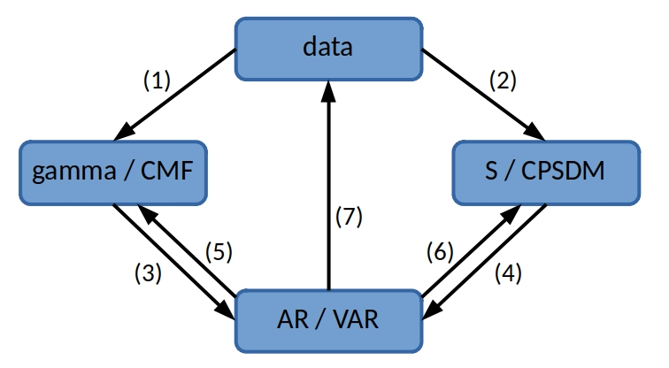

# Introduction

**mVARbox** is a Matlab toolbox for uni/multivariate data series analysis in both time and frequency domains, with special focus on multivariate autoregressive (VAR) models. By using **mVARbox**, you will be able to, among others:

- estimate auto/cross spectra from time series using different estimation methods (Welch, Blackman-Tukey, Daniell, etc.),
- obtain optimal Autoregressive Models that reproduce a predefined target covariance/spectral structure,
- generate uni/multivariate synthetic time series [(watch an example video).](http://arya.dave.upm.es/media/mVARbox_synthetic_wind_field.mp4)
- ...

**mVARbox** is a software tool developed by professors and students of the Rotary Wing and Wind Turbines unit ([ARYA](http://arya.dave.upm.es/05_software.html)) within the Department of Aircraft and Space Vehicles at the Universidad Politécnica de Madrid.

**mVARbox** is specifically designed for educational and research purposes, It is released as free software under GNU General Public License (GPL) version 3. This license grants users the freedom to redistribute and modify the software according to the terms and conditions outlined in the GPL v3. It ensures that the software remains open-source and promotes the principles of Open Science.

To get a fresh copy of **mVARbox**, clone the git repository located [here](https://github.com/arya-upm/mVARbox). You can also [download](https://github.com/arya-upm/mVARbox/archive/refs/heads/main.zip) it directly.

# mVARbox in a nutshell

**mVARbox** works with mathematical objects, and enables intuitive links between them. The main classes included are:

- `data`, to handle uni/multivariate data series (time series and space series).
- `AR`, to handle autoregressive models.
- `VAR`, to handle multivariate autoregressive models.
- `gamma`, to handle auto/cross covariance functions.
- `CMF`, to handle covariance matrix functions.
- `S` to handle auto/cross power spectral densities (PSDs).
- `CPSDM`, to handle coss power spectral density matrices.

Note that `VAR`, `CMF` and `CPSDM` are the multivariate version of `AR`, `gamma` and `S`, respectively.

The following figure shows the links between classes that are implemented in **mVARbox**.

 
In the figure, each row corresponds to the process of converting an object from one specific class to another distinct class. Different rows involve different mathematical problems or procedures. Below is a short description of each of them:

- **(1): Estimation of the covariance function of data series**. 
- **(2): Spectral estimation from data series**. Several methods based on correlogram and periodogram approaches are implemented. You will find specific functionalities that are typically absent in other software packages. For instance, you can define precise frequency values for spectrum evaluation, enabling enhanced spectral resolution in plots with frequency-log scales.
- **(3) and (4): Estimation of an autoregressive model from either a covariance function or a power spectral density**. The estimation of an AR/VAR model from a covariance function includes the possibility of restricted VAR models, where only specific lags are considered in the model scheme. Restricted AR models are particulary useful for processes with a slow decay of their covariance function. The estimation of an AR/VAR model from the PSD is less common in the literature, but it becomes very handy when modelling processes that are described in the frequency domain.
- **(5) and (6): Obtention of the theoretical covariance function and power spectral density of an autoregressive model**.
- **(7) Data synthesis from an autoregressive model**. This allows you to generate synthetic time or space series with prescribed statistical features (those of the employed AR/VAR model).

## Functions `initialise_(class)`

To get a complete overview of the classes included in **mVARbox**, have a look at folder [initialise_objects/](https://github.com/arya-upm/mVARbox/tree/main/initialise_objects). This folder contains the functions employed to initialise objects of a particular class. Additionally, within each corresponding initialisation function, you will find a comprehensive description of the fields associated with each class. An object can be initialised either empty or with only a subset of the available fields.

## Functions `get_(class1)_(class2)`

These are the functions that users will handle in most cases. A function named `get_(class1)_(class2)` indicates that the output is an object belonging to class1, and it is generated using an object of class2 as the input. For example, the function `get_gamma_data` is used to obtain the covariance function (the output is `gamma`) from a dataset (the input is `data`). This relationship is depicted as arrow (1) in the plot above.

In certain cases, a function's name may include a third label, like in `get_(class1)_(class2)_(method)`. This label is used for operations that can be performed using multiple methods, see for example functions `get_S_data_Welch` and `get_S_data_BT` for spectral estimation through Welch and Blackman-Tukey estimator, respectively.

The documentation provided within each function provides a comprehensive description of the fields that need to be populated in the input objects, as well as the fields that are populated in the output objects during the function execution. 

## Functions `fun_`

These are auxiliary functions designed to carry out secondary operations. Typically, users do not need to interact with them directly. The main exceptions are described in Tutorial **T0_starting_with_mVARbox** (see below).

## Function `fun_default_value`

This is a special function located in folder [funs/](https://github.com/cristobal-GC/mVARbox/tree/main/funs). 
It contains default values for a number of parameters and fields.
When optional input parameters are omitted, they are automatically assigned the corresponding default values from this function. Users have the flexibility to modify these default values by editing the function

## Tutorials

**mVARbox** includes an extensive set of well-documented and illustrative tutorials. These tutorials are arranged based on the functionalities described in the figure above. For example, if you are interested in spectral estimation from data, arrow (2), you are recommended to have a look at tutorials labeled with **T2_**.

Tutorials are located in folder [tutorials/](https://github.com/arya-upm/mVARbox/tree/main/tutorials). The corresponding [pdf files](http://arya.dave.upm.es/library/mVARbox_tutorials/) are also available.

# First steps and feedback...

To start using **mVARbox**, we recommend you to go through tutorial **T0_starting_with_mVARbox**. 

We hope you enjoy and find **mVARbox** useful. 

Please write to *cristobaljose.gallego AT upm DOT es* to report bugs and provide feed-back. The authors and future users will be very grateful.

# List of authors and maintainers

- Cristóbal J. Gallego Castillo [(orcid)](https://orcid.org/0000-0002-8249-5179)
- Álvaro Cuerva Tejero [(orcid)](https://orcid.org/0000-0002-1690-1634)
- Óscar López García [(orcid)](https://orcid.org/0000-0002-0209-2469)

## List of contributors

- Mohanad Elagamy [(orcid)](https://orcid.org/0000-0001-8427-0195)
- Luis Mora de la Cruz

# Related publications

Gallego-Castillo, C.; Cuerva-Tejero, A.; Elagamy, M.; Lopez-Garcia, O. & Avila-Sanchez, S. A tutorial on reproducing a predefined autocovariance function through AR models: Application to stationary homogeneous isotropic turbulence. Stochastic Environmental Research and Risk Assessment, 2021, 36, 2711-2736. DOI: [10.1007/s00477-021-02156-0](https://link.springer.com/article/10.1007/s00477-021-02156-0)

Elagamy, M.; Gallego-Castillo, C.; Cuerva-Tejero, A.; Lopez-Garcia, O. & Avila-Sanchez, S. Eigenanalysis of vector autoregressive model for optimal fitting of a predefined cross power spectral density matrix: Application to numeric generation of stationary homogeneous isotropic/anisotropic turbulent wind fields. Journal of Wind Engineering and Industrial Aerodynamics, 2023, 238, 105420. DOI: [10.1016/j.jweia.2023.105420](https://doi.org/10.1016/j.jweia.2023.105420)

Elagamy, M.; Gallego-Castillo, C.; Cuerva-Tejero, A.; Lopez-Garcia, O. & Avila-Sanchez, S. Optimal autoregressive models for synthetic generation of turbulence. Implications of reproducing the spectrum or the autocovariance function. 17th European Academy of Wind Energy (EWEA) PhD Seminar on Wind Energy, Porto (Portugal), 2021. [(proceedings)](https://phd2021.eawe.eu/proceedings/)

Luis Mora de la Cruz, Spectral estimation methods from finite time series: application to wind energy related variables. ETSIAE, Universidad Politécnica de Madrid, Master thesis, 2023. [(link)](https://oa.upm.es/73226/)

