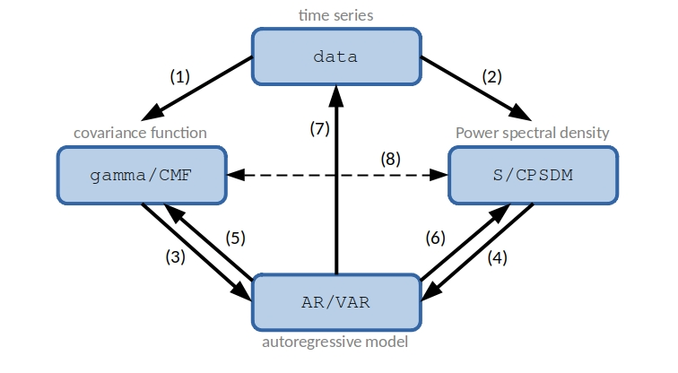

.. mVARbox documentation master file, created by
   sphinx-quickstart on Sun Jun 23 08:37:10 2024.
   You can adapt this file completely to your liking, but it should at least
   contain the root `toctree` directive.

  SPDX-License-Identifier: CC-BY-4.0

##########################################################################################
mVARbox in a nutshell
##########################################################################################

**mVARbox** works with mathematical objects, and enables intuitive links between them. The main classes included are:

- ``data``, to handle uni/multivariate data series (time series and space series).
- ``AR``, to handle autoregressive models.
- ``VAR``, to handle multivariate autoregressive models.
- ``gamma``, to handle auto/cross covariance functions.
- ``CMF``, to handle covariance matrix functions.
- ``S`` to handle auto/cross power spectral densities (PSDs).
- ``CPSDM``, to handle coss power spectral density matrices.

Note that `VAR`, `CMF` and `CPSDM` are the multivariate version of ``AR``, ``gamma`` and ``S``, respectively.

The following figure shows the links between classes that are implemented in **mVARbox**.

 
In the figure, each row corresponds to the process of converting an object from one specific class to another distinct class. Different rows involve different mathematical problems or procedures. Below is a short description of each of them:

- **(1): Estimation of the covariance function of data series**. 
- **(2): Spectral estimation from data series**. Several methods based on correlogram and periodogram approaches are implemented. You will find specific functionalities that are typically absent in other software packages. For instance, you can define precise frequency values for spectrum evaluation, enabling enhanced spectral resolution in plots with frequency-log scales.
- **(3) and (4): Estimation of an autoregressive model from either a covariance function or a power spectral density**. The estimation of an AR/VAR model from a covariance function includes the possibility of restricted VAR models, where only specific lags are considered in the model scheme. Restricted AR models are particulary useful for processes with a slow decay of their covariance function. The estimation of an AR/VAR model from the PSD is less common in the literature, but it becomes very handy when modelling processes that are described in the frequency domain.
- **(5) and (6): Obtention of the theoretical covariance function and power spectral density of an autoregressive model**.
- **(7): Data synthesis from an autoregressive model**. This allows you to generate synthetic time or space series with prescribed statistical features (those of the employed AR/VAR model).
- **(8):** Applications of the **Wiener-Khinchin theorem**.

Functions ``initialise_(class)``
==========================================================================================

To get a complete overview of the classes included in **mVARbox**, have a look at folder [initialise_objects/](https://github.com/arya-upm/mVARbox/tree/main/initialise_objects). This folder contains the functions employed to initialise objects of a particular class. Additionally, within each corresponding initialisation function, you will find a comprehensive description of the fields associated with each class. An object can be initialised either empty or with only a subset of the available fields.

Functions ``get_(class1)_(class2)``
==========================================================================================

These are the functions that users will handle in most cases. A function named ``get_(class1)_(class2)`` indicates that the output is an object belonging to class1, and it is generated using an object of class2 as the input. For example, the function `get_gamma_data` is used to obtain the covariance function (the output is `gamma`) from a dataset (the input is `data`). This relationship is depicted as arrow (1) in the plot above.

In certain cases, a function's name may include a third label, like in ``get_(class1)_(class2)_(method)``. This label is used for operations that can be performed using multiple methods, see for example functions `get_S_data_Welch` and `get_S_data_BT` for spectral estimation through Welch and Blackman-Tukey estimator, respectively.

The documentation provided within each function provides a comprehensive description of the fields that need to be populated in the input objects, as well as the fields that are populated in the output objects during the function execution. 

Functions ``fun_``
==========================================================================================

These are auxiliary functions designed to carry out secondary operations. Typically, users do not need to interact with them directly. The main exceptions are described in Tutorial **T0_starting_with_mVARbox** (see below).

Function ``fun_default_value``
==========================================================================================

This is a special function located in folder `funs/ <https://github.com/cristobal-GC/mVARbox/tree/main/funs>`_. 
It contains default values for a number of parameters and fields.
When optional input parameters are omitted, they are automatically assigned the corresponding default values from this function. Users have the flexibility to modify these default values by editing the function

